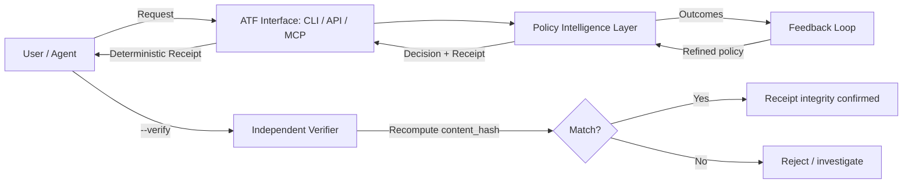

# ATF Architecture Overview (Public)

This document describes the high-level architecture of ATF, focusing on the public contract: how clients interact with ATF and the deterministic receipts they receive.

This document does not describe internal components, enforcement logic, or policy semantics.

## Components

### 1) CLI

- Convenient invocation and deterministic verification.
- Output: receipt JSON with deterministic `content_hash`.

Typical flow:

1. User or agent submits a request via CLI.
2. ATF evaluates the request.
3. ATF returns a deterministic receipt.
4. Any party verifies receipt integrity (`--verify`).

### 2) API

- Programmatic integration for agents and services.
- Returns the same deterministic receipt model as CLI.
- Supports caller-provided `request_id` for correlation (passthrough semantics).

### 3) Hosted MCP

- Tool-based integration surface for agent runtimes that support Model Context Protocol.
- Five tools: `probe_transaction`, `simulate_transaction`, `protect_transaction`, `verify_receipt`, `explain_decision`.
- Same enforcement engine and receipt format as CLI and API.
- See [docs/mcp-integration.md](../docs/mcp-integration.md) for the public overview.

### 4) Core enforcement engine (private)

- Evaluates requests against policy configuration.
- Produces deterministic receipts.
- **Remains private by design.** Not described in this spec.

This public repo specifies the *interface contract* and *verification format* that the private core must uphold.

## Deterministic receipts

Receipts are the core trust artifact:

- Deterministic `content_hash` (SHA-256 of JCS-canonicalized receipt).
- Input binding via `inputs.request_hash` and `inputs.context_hash`.
- Stable `request_id` for end-to-end correlation.
- Explicit `receipt_version` for schema evolution.

See:
- `spec/receipt.md` -- schema and canonicalization rules
- `spec/verification.md` -- verification procedure

## Conceptual flow

The Policy Intelligence Layer (PIL) connects policy enforcement before
execution, verified receipts after decisions, and a feedback loop that
improves capital deployment over time. See
[docs/policy-intelligence-layer.md](../docs/policy-intelligence-layer.md)
for the public conceptual overview.

## Roadmap (public contract perspective)

ATF is designed to support additional trust layers over time without breaking the deterministic receipt core:

- **Receipt signing** (optional): issuer identity and non-repudiation.
- **On-chain attestation** (optional): anchor receipts or policy hashes for external auditability.

These additions can be layered while keeping the verification contract stable.

## Design principles

- **Fail-closed** for high-risk actions.
- **Minimal disclosure** -- hashes over raw inputs; no policy internals exposed.
- **Deterministic verification** -- any party can verify, no secrets required.
- **Explicit versioning** via `receipt_version` for backward-compatible evolution.